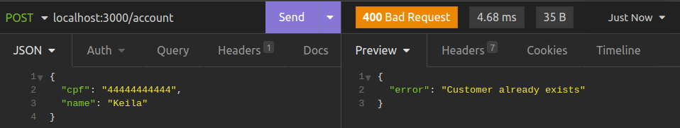
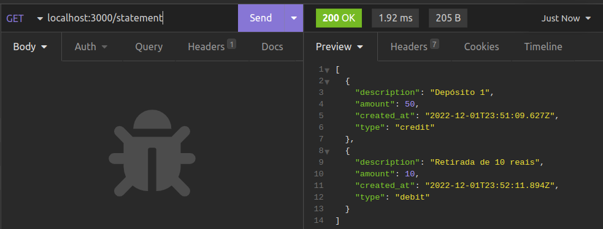
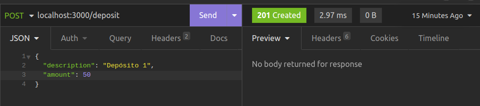

# FinApi: API Financeira 

## Tecnologias utilizadas:
- Node.Js;
- Express;
- Typescript

---

<br>

Este projeto foi feito seguindo orientação da desenvolvedora <b>Dani Leão</b> no curso de Node.Js pela Rocketseat.

O projeto FinAPI é uma API Financeira simples, onde é possível fazer operações CRUD (Create, Read, Update, Delete) de contas, realizar depósitos, saques, ver extrato, entre outros.

A aplicação original possuia Node.Js com Express, e os códigos ficavam apenas em um arquivo.

Para exercitar a organização do projeto, decidi separar por diretórios, com controller, services e routes. Adicionei Typescript a este projeto para poder praticá-lo mais.

Como resultado, apesar de ser uma aplicação simples pude trabalhar com alguns conceitos como <b>middleware</b>, pude praticar o <b>Typescript</b>, usei <b>padrão MVC</b> e pude usar o raciocínio lógico para resolver problemas que apareciam. 

Abaixo estão os requisitos e regras de negócio que a aplicação pedia. 
Em seguida, estarão listadas instruções para baixar e rodar este projeto localmente, em sua máquina. A seguir, estarão as rotas e os resultados esperados das requisições.


<br>

---

<br>

## Requisitos

* Deve ser possível criar uma conta
* Deve ser possível buscar o extrato bancário do cliente
* Deve ser possível realizar um depósito
* Deve ser possível realizar um saque
* Deve ser possível buscar o extrato bancário do cliente por data
* Deve ser possível atualizar dados da conta do cliente
* Deve ser possível obter dados da conta do cliente
* Deve ser possível deletar uma conta


<br>

## Regras de negócio

* Não deve ser possível cadastrar uma conta com CPF já existente
* Não deve ser possível fazer depósito em uma conta não existente
* Não deve ser possível buscar extrato em uma conta não existente
* Não deve ser possível fazer saque em uma conta não existente
* Não deve ser possível excluir uma conta não existente
* Não deve ser possível fazer saque quando o saldo for insuficiente

<br>

---
<br>

## Pré-requisitos 
Você precisa ter instalado em sua máquina as ferramentas:

* Sistema de controle versão [Git](https://git-scm.com),

* [Node.js](https://nodejs.org/en/),

* Editor de texto, por exemplo, [VSCode](https://code.visualstudio.com)

* API Client (para testar a API), recomendo o [Insomnia](https://insomnia.rest/)

<br>

## Instruções para rodar o projeto localmente

<br>

```bash
# clone o repositório usando SSH
git clone git@github.com:keilapassos/fin-api-node-js-typescript.git
# ou usando HTTPS
git clone https://github.com/keilapassos/fin-api-node-js-typescript.git

# acesse a pasta do projeto no terminal
cd fin-api-node-js-typescript

# você pode ver os códigos do projeto abrindo-o em seu editor de texto, exemplo com VSCode
code .

# instale as dependências - irá criar uma pasta 'node_modules'
npm install

# execute a aplicação em modo de desenvolvimento
npm run dev

# a aplicação iniciará na porta 3000
# acesse http://localhost:3000 no seu navegador ou API Client.
# ** Observação: apenas os métodos get podem rodar via navegador, outros métodos rodam apenas via API CLient
```

<br>

## Rotas da aplicação
URL base:
<http://localhost:3000>

```bash
# No API Client, adicione um novo HTTP Request (exemplo: POST json)
# em seguida adicione a url base com o seu endpoint, exemplo:
# POST http://localhost:3000/account

# Em todas as rotas EXCETO no endpoint <POST http://localhost:3000/account>, temos que informar o cpf em Headers
```

### com o servidor rodando (npm run dev), vamos aos endpoints:
<br>

<b>POST /account</b>

- criado com sucesso - 201 created
<div align="center">

</div>

- error - 400
- cliente já existe
<div align="center">

</div>

---
<br>

<b>GET /account</b>

- sucesso - 200 ok
<div align="center">

</div>

- error - 400 
- cliente não encontrado
<div align="center">

</div>

---
<br>

<b>PUT /account</b>

- body da requisição
<div align="center">

</div>

- sucesso - 200 ok
<div align="center">

</div>

- error - 400
- cliente não encontrado
<div align="center">

</div>

---
<br>

<b>DELETE /account</b>

- sucesso - 200 ok
<div align="center">

</div>

- error - 400
- cliente não encontrado
<div align="center">

</div>

---
<br>

<b>GET /statement</b>

- sucesso - 200 ok
- inicia com array vazio
<div align="center">

</div>

- sucesso - 200 ok
- após realizar operações de crédito
<div align="center">

</div>

- sucesso - 200 ok
- após realizar operações de débito e crédito 
<div align="center">

</div>

---
<br>

<b>POST /deposit</b>

- sucesso - 200 ok
<div align="center">

</div>

- sucesso - 200 ok
- depositando a primeira vez
<div align="center">

</div>

- sucesso - 200 ok
- depositando pela segunda vez
<div align="center">

</div>

- error - 400
- cliente não encontrado
<div align="center">

</div>

---
<br>

<b>POST /withdraw</b>

withdraw = saque/retirada de dinheiro

- sucesso - 200 ok
<div align="center">

</div>

- sucesso - 200 ok
<div align="center">

</div>

- error - 400
- cliente não encontrado
<div align="center">

</div>

---
<br>

<b>GET /balance</b>

- sucesso - 200 ok
- mostra o total disponível
<div align="center">

</div>

- error - 400
- cliente não encontrado
<div align="center">

</div>

<br>

---

<br>

<div align="center">Desenvolvido por Keila Passos

[Linkedin](https://www.linkedin.com/in/keila-aparecida-rodrigues-passos/)

[Perfil do Github](https://github.com/keilapassos)

<h4><i>Projeto em desenvolvimento/refatoração</i></h4>
</div>

---


